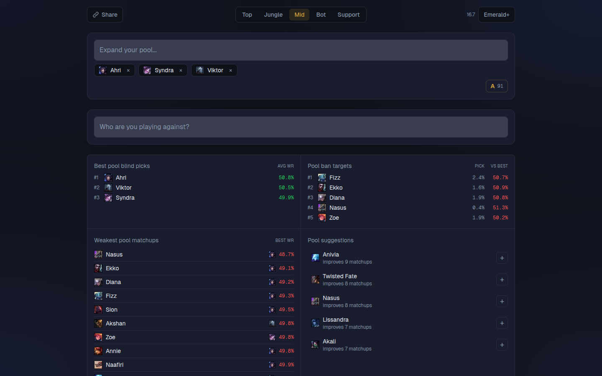
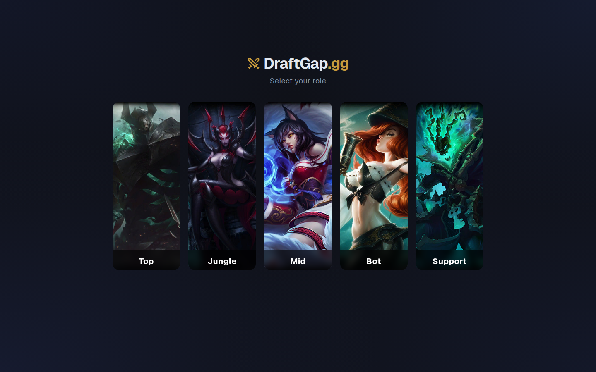
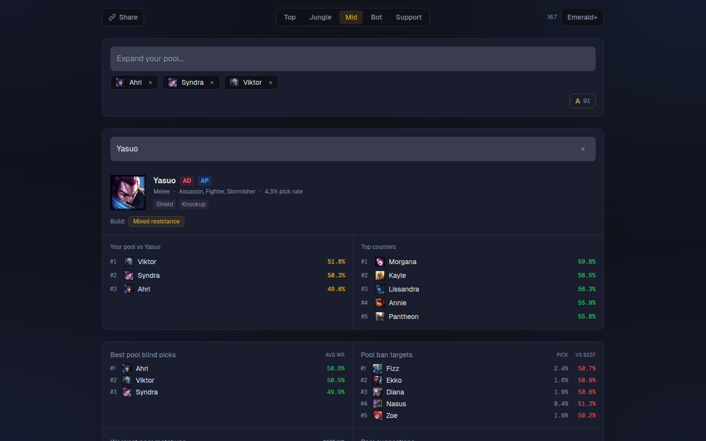
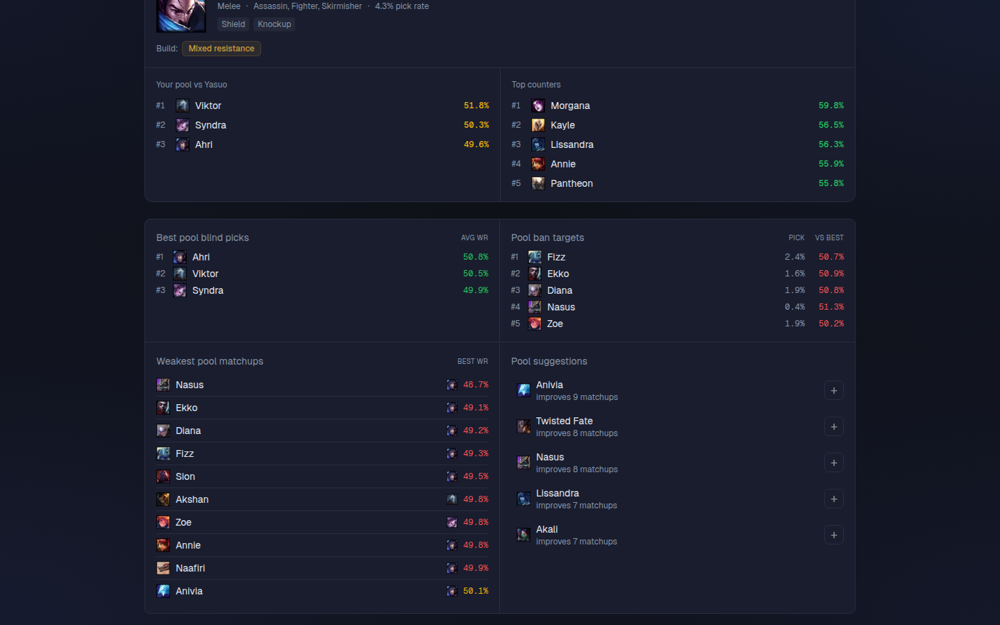

# DraftGap

A champion pool optimizer for League of Legends. Select your role and champions, then get matchup analysis, coverage gaps and data-driven suggestions to strengthen your pool.

Built with real winrate data from U.GG (Emerald+, Platinum+, All Ranks).



## Features

- **Pool Analysis**: blind pick rankings, ban targets and a pool grade score (A/B/C/D/F)
- **Enemy Lookup**: search any opponent to see your best counter pick, their damage types, CC abilities and build recommendations
- **Gap Detection**: finds bad matchups where your entire pool has a sub-50% winrate
- **Smart Suggestions**: recommends champions that cover the most gaps in your pool
- **Duo Synergy**: best support pairings for bot lane (and vice versa) with duo winrates
- **Pool Sharing**: share your pool via URL so others can view your analysis
- **Multi-Tier**: switch between Emerald+, Platinum+ and All Ranks data
- **Responsive**: fully usable on mobile

<details>
<summary>More screenshots</summary>

| Role Picker                                                    | Enemy Detail                                                     |
| -------------------------------------------------------------- | ---------------------------------------------------------------- |
|  |  |



</details>

## Stack

- **Next.js 16** (App Router, Turbopack)
- **TypeScript** (strict mode)
- **Tailwind CSS 4**
- **Jest 30** + React Testing Library
- **Data**: Static JSON from U.GG, DDragon CDN for champion icons

## Getting Started

```bash
npm install
npm run dev
```

Open [localhost:3000](http://localhost:3000).

## Data Pipeline

Matchup data is pre-generated and stored as static JSON per role and tier.

```bash
npm run generate-data
```

This scrapes U.GG for matchup winrates, Meraki Analytics for champion metadata (damage types, CC, traits), and the U.GG duos API for bot/support synergy data. Output goes to `data/matchups/`.

## Architecture

```
app/page.tsx              → Single-page app: role picker → champion picker → dashboard
app/api/matchups/[role]   → Serves matchup data per role + tier
app/api/champions/[role]  → Champion list per role
lib/matchup-engine.ts     → Pure functions: findGaps, suggestChampions, bestPick
lib/pool-score.ts         → Pool grade scoring (A-F based on coverage)
lib/url-sharing.ts        → Encode/decode pool state to URL params
data/matchups/*.json      → Static matchup data per role per tier
```

Key patterns:

- **Bi-directional lookups**: if A vs B = 42%, then B vs A ≈ 58%
- **Sparse data aware**: UI only shows opponents with real matchup data
- **DDragon ID mapping**: normalizes display names to DDragon IDs (e.g. MonkeyKing → Wukong)

## Scripts

| Command                 | Description             |
| ----------------------- | ----------------------- |
| `npm run dev`           | Dev server (Turbopack)  |
| `npm run build`         | Production build        |
| `npm test`              | Jest test suite         |
| `npm run lint`          | ESLint                  |
| `npm run generate-data` | Regenerate matchup data |
